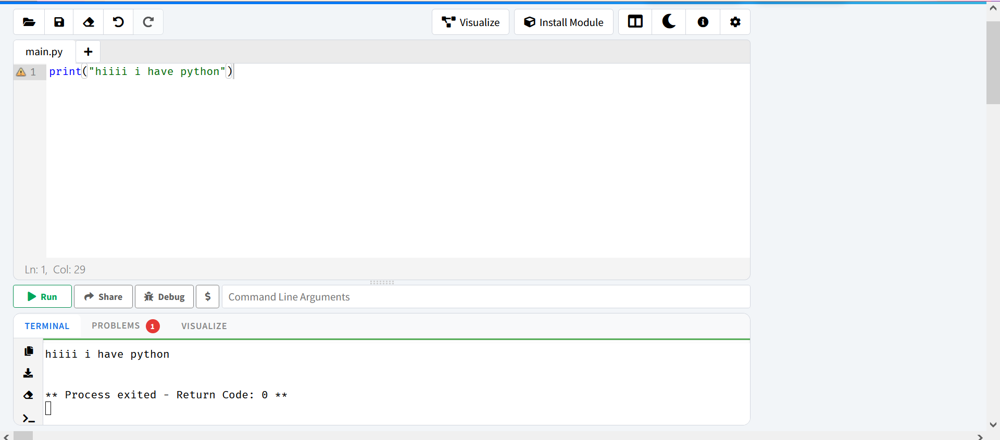
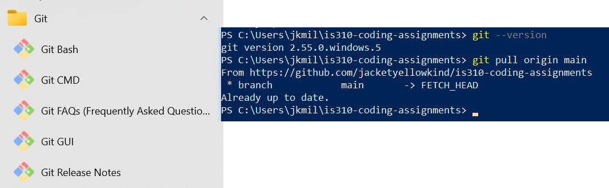

# Init IS310 Homework

## Proof of Installation

1. Python

2. Git

3. VS Code

VS Code won't run on my computer, so I'm going to be finding a stand-in for it as I continue working.  I've coded before in a browser-based alternative so I'll probably just use one of those again.

4. Hypothesis Username

yellowjacket

6. AI Tool/Workflow

I did not use any AI in this assignment, and I will not use an AI in future assignments. 
